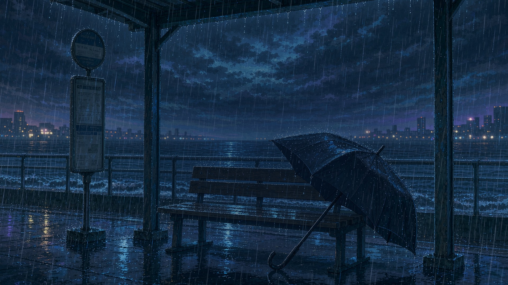
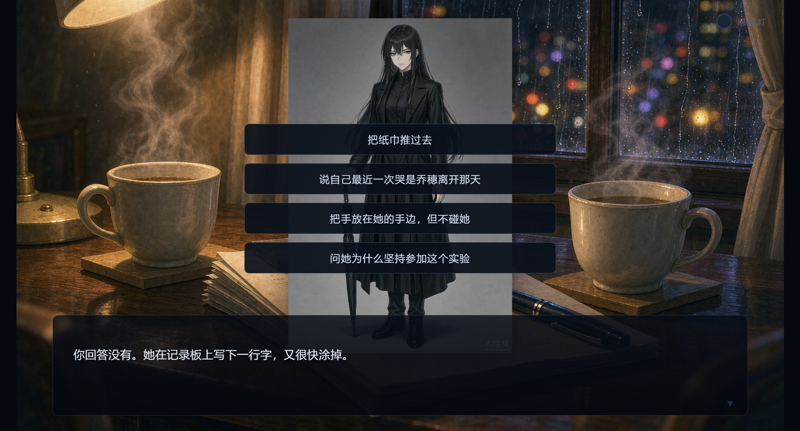
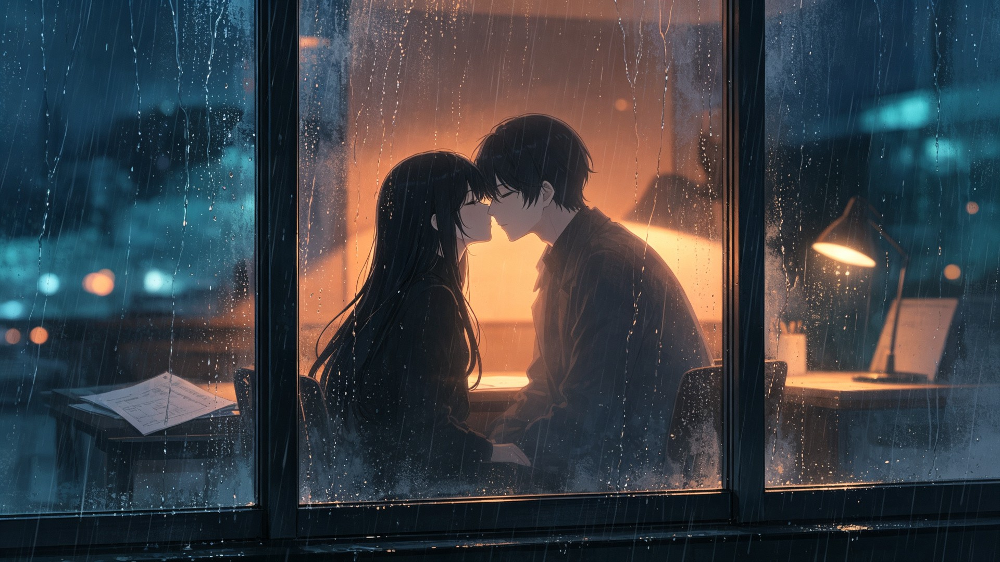
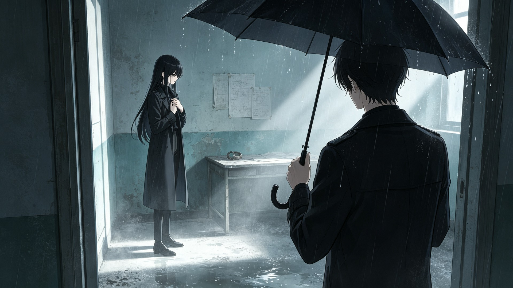
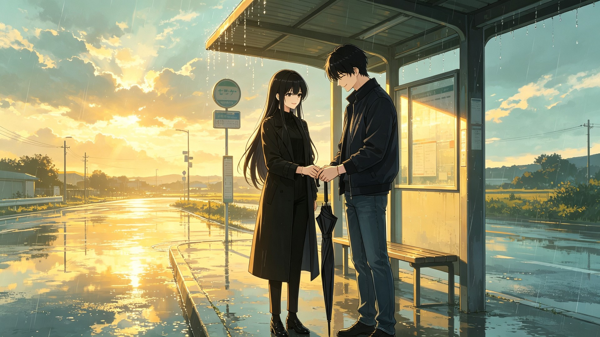

<div align="center">



# 第七夜同频

**一场只有七天的亲密关系实验，一段从雨夜开始的悬疑恋爱。**

[官方网站](https://hwkiller-0314.github.io/the-seventh-night/) ·
[下载 Windows 版](https://github.com/hwkiller-0314/the-seventh-night/releases) ·
[游戏简介](#游戏简介) ·
[截图](#截图) ·
[更新日志](CHANGELOG.md) ·
[反馈与建议](https://github.com/hwkiller-0314/the-seventh-night/issues)


</div>

## 游戏简介

《第七夜同频》是一款国产心理悬疑恋爱视觉小说。

你在一场“亲密关系重建计划”中，与陌生人 S-07 共同生活七天。你们佩戴着记录心跳的手环，完成一项又一项关于距离、信任和边界的任务。随着心率曲线逐渐靠近，你发现她进入实验的目的并不简单，而三年前那把黑伞，似乎也把你们引向了同一个雨夜。

本作以第二人称叙事，结合心理悬疑、校园恋爱、边界确认和多重结局。所有角色均为成年人，本作不包含裸露画面。

## 游戏特色

- **七日同居实验**：从陌生到靠近，关系变化由每一次选择推动。
- **四维隐藏数值**：信任、同频、真相、清醒共同影响结局。
- **同频灯与心率系统**：两个人的心跳越接近，蓝色灯越亮。
- **边界与同意**：亲密关系不是奖励，而是一次次被认真确认的选择。
- **五个可达结局**：同频、雨停、各自成长、失温、008。
- **完整视听演出**：立绘差分、剧情 CG、雨夜视频、器乐 BGM 与音效。
- **Windows 桌面版**：Electron 构建，支持窗口与全屏模式。

## 截图

### 雨夜与黑伞


### 关系选择



### 雨窗将吻



### 答案之后



### 雨停了就回家



## 下载

前往 [Releases](https://github.com/hwkiller-0314/the-seventh-night/releases) 下载最新版 Windows 安装包。

当前版本：

```text
第七夜同频 v1.3.0
```

安装包下载后直接运行即可。首次运行时 Windows 可能会显示 SmartScreen 提示，选择“更多信息”后点击“仍要运行”。

## 系统要求

- Windows 10 / Windows 11
- 64 位处理器
- 4 GB 以上内存
- 约 1 GB 可用磁盘空间
- 建议使用 1280×720 或更高分辨率

## 操作

- 鼠标左键：推进剧情 / 选择选项
- `Space` / `Enter`：推进剧情
- `A`：自动播放
- `Esc`：打开暂停菜单

## 游戏内容

- 类型：心理悬疑 / 校园恋爱 / 视觉小说
- 视角：第二人称
- 主线：单女主单线多结局
- 时长：单周目约 30 至 60 分钟
- 平台：Windows
- 价格：免费发布

## 开发说明

本作由个人开发者使用 DeepSeek 与 Codex 辅助完成，包含剧本、程序、美术整理、音频与视频整合等工作。

如果你在游玩中遇到问题，欢迎通过 [Issues](https://github.com/hwkiller-0314/the-seventh-night/issues) 提交：

- 你的 Windows 版本
- 出现问题的具体步骤
- 报错截图或录屏
- 是否能稳定复现

## 更新日志

查看 [CHANGELOG.md](CHANGELOG.md)。

## 版权与素材

本仓库目前主要发布游戏安装包、说明文档和展示素材。游戏内文本、美术、音频与视频素材版权归作者所有，未经许可请勿用于商业再发行、二次售卖或冒充原作者发布。

如果你发现仓库中的素材存在版权或来源问题，请通过 Issues 联系作者处理。

## 如果你喜欢这个游戏

- 点一个 **Star**，让更多人看到这个项目。
- 在 Issues 里留下你的结局和反馈。
- 把游戏分享给喜欢视觉小说或心理悬疑故事的朋友。

---

<div align="center">

**同频灯亮起之前，不要相信雨会停。**

</div>
